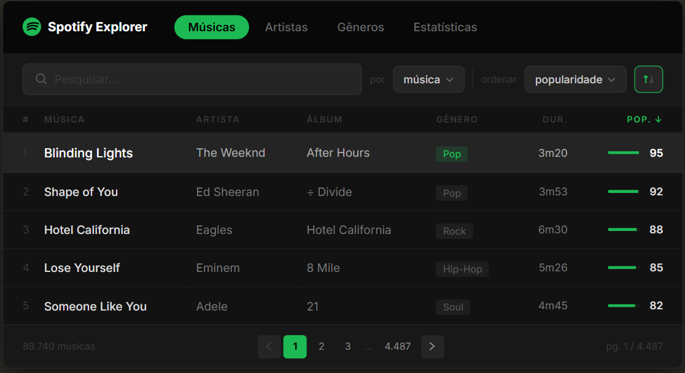
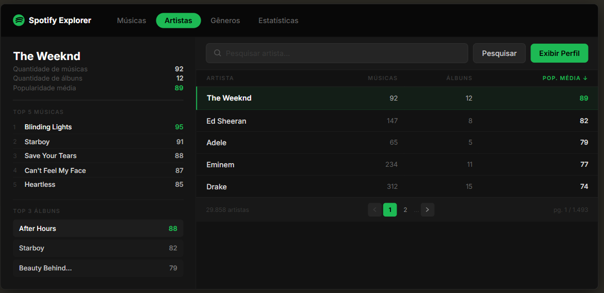
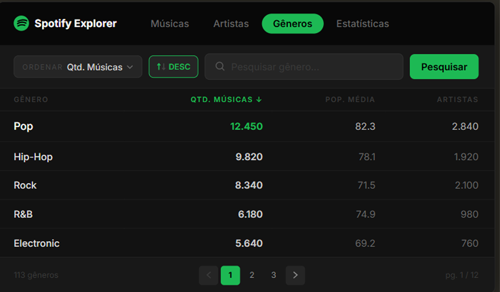
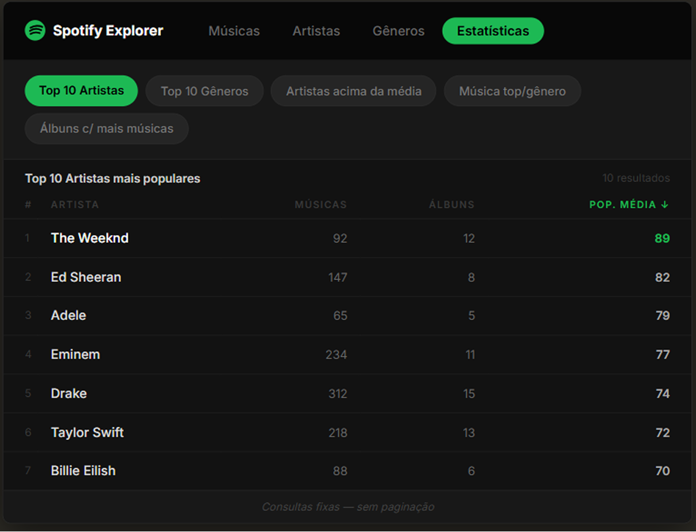

# 🎵 Spotify Explorer

Sistema Web para exploração e consulta de informações musicais baseado em um banco de dados construído a partir de um dataset do Spotify.

Desenvolvido como projeto final da disciplina de Banco de Dados, o Spotify Explorer integra modelagem de dados, processamento de datasets e desenvolvimento Web, permitindo consultas eficientes por meio de uma interface moderna construída com Flask.

A aplicação utiliza MySQL como sistema gerenciador de banco de dados e SQLAlchemy como camada de acesso aos dados, empregando consultas SQL, agregações, ordenações e relacionamentos para disponibilizar informações sobre músicas, artistas, álbuns e gêneros musicais.

---

# 📚 Objetivo

O projeto possui como objetivos:

- Construção do modelo conceitual
- Conversão para o modelo lógico
- Implementação do modelo físico
- Criação do banco de dados em MySQL
- Limpeza, normalização e processamento do dataset
- População automática das tabelas
- Desenvolvimento de uma aplicação Web utilizando Flask
- Execução e validação das consultas propostas

---

# 🗂 Estrutura do Projeto

```text
Projeto/
│
├── app_concepts/
│   ├── home.png
│   ├── search.png
│   ├── details.png
│   └── ...
│
├── database/
│   └── spotify_db_export.sql
│
├── dataset/
│   └── dataset_limpo.csv
│
├── model/
│   ├── conceitual/
│   │   └── modelo_conceitual.brM3
│   │
│   ├── logico/
│   │   └── modelo_logico.brM3
│   │
│   └── fisico/
│       └── modelo_fisico.brM3
│
├── project/
│   ├── app/
│   │   ├── static/
│   │   │   └── css/
│   │   │       └── style.css
│   │   │
│   │   ├── templates/
│   │   │   ├── base.html
│   │   │   └── index.html
│   │   │
│   │   ├── __init__.py
│   │   ├── config.py
│   │   ├── models.py
│   │   ├── queries.py
│   │   └── routes.py
│   │
│   ├── venv/
│   ├── .env
│   ├── .env.example
│   ├── .gitignore
│   ├── README.md
│   ├── requirements.txt
│   └── run.py
│
├── relatorios/
│   └── relatorio_parcial.pdf
│
├── screenshots/
│   └── imagens_utilizadas_nos_relatorios/
│
├── scripts/
│   ├── process_dataset.py
│   ├── clean_dataset.py
│   └── create_tables.py
│
├── scripts_output/
│   ├── genero.csv
│   ├── artista.csv
│   ├── album.csv
│   ├── musica.csv
│   └── participacao.csv
│
└── sql/
    └── create_database.sql
```

---

# 📁 Descrição das Pastas

## app_concepts/

Armazena os protótipos e conceitos visuais desenvolvidos para a interface da aplicação.

São utilizados como referência durante o desenvolvimento do front-end.

---

## database/

Contém o arquivo SQL exportado do banco de dados completo.

Inclui:

- Estrutura das tabelas
- Chaves primárias
- Chaves estrangeiras
- Dados populados

Permite recriar completamente o banco de dados.

---

## dataset/

Contém o dataset tratado utilizado durante o projeto.

Foram realizadas etapas de:

- Remoção de duplicatas
- Limpeza de registros inválidos
- Padronização dos dados
- Preparação para normalização

---

## model/

Armazena todos os modelos produzidos utilizando o brModelo.

### conceitual/

Modelo Entidade-Relacionamento desenvolvido durante o levantamento de requisitos.

### logico/

Conversão do modelo conceitual para o modelo relacional.

### fisico/

Modelo físico implementado no MySQL contendo tipos de dados, restrições e relacionamentos.

---

## project/

Contém toda a aplicação Web desenvolvida utilizando Flask.

### app/

É o pacote principal da aplicação.

Responsável por concentrar toda a lógica da aplicação.

#### static/

Arquivos estáticos utilizados pelo navegador.

No projeto atual contém:

- folhas de estilo (CSS)
- imagens (quando adicionadas futuramente)
- arquivos JavaScript (caso necessário)

#### templates/

Arquivos HTML renderizados pelo Flask utilizando o mecanismo Jinja2.

- **base.html**

  Template base contendo a estrutura comum das páginas.

- **index.html**

  Página inicial da aplicação.

---

### __init__.py

Inicializa a aplicação Flask.

Responsável por:

- criar a aplicação
- carregar configurações
- registrar as rotas
- inicializar extensões

---

### config.py

Centraliza todas as configurações da aplicação.

Exemplos:

- conexão com o banco
- variáveis de ambiente
- configurações gerais do Flask

---

### models.py

Define as classes responsáveis pelo mapeamento das tabelas do banco utilizando SQLAlchemy.

Representa as entidades da aplicação.

---

### queries.py

Centraliza consultas SQL e operações de acesso ao banco de dados.

Seu objetivo é manter a lógica de consultas separada das rotas.

---

### routes.py

Define todas as rotas da aplicação.

Também é responsável por:

- receber requisições
- processar parâmetros
- chamar consultas
- renderizar os templates HTML

---

### run.py

Arquivo principal utilizado para iniciar o servidor Flask.

---

### requirements.txt

Lista todas as dependências Python necessárias para executar o projeto.

---

### .env.example

Modelo do arquivo `.env`, utilizado como referência para configuração do ambiente.

---

### .gitignore

Define quais arquivos e diretórios não devem ser enviados ao Git.

---

### venv/

Ambiente virtual Python contendo todas as bibliotecas instaladas para o projeto.

---

## relatorios/

Contém os relatórios produzidos durante o desenvolvimento do projeto.

---

## screenshots/

Armazena capturas de tela utilizadas como evidências no relatório.

Exemplos:

- criação do banco
- consultas SQL
- funcionamento da aplicação
- resultados obtidos

---

## scripts/

Scripts Python utilizados para preparação do dataset.

Entre suas funções estão:

- leitura dos arquivos CSV
- limpeza dos dados
- normalização
- separação das entidades
- geração dos arquivos finais

---

## scripts_output/

Arquivos CSV gerados automaticamente pelos scripts.

Cada arquivo corresponde a uma tabela do banco de dados.

---

## sql/

Scripts SQL utilizados durante o desenvolvimento.

Incluem:

- criação das tabelas
- constraints
- relacionamentos
- consultas auxiliares

---

# ⚙️ Como executar o projeto

## 1. Clone o repositório

```bash
git clone <url-do-repositório>

cd Projeto/project
```

---

## 2. Crie um ambiente virtual

### Windows

```bash
python -m venv venv

venv\Scripts\activate
```

### Linux/macOS

```bash
python3 -m venv venv

source venv/bin/activate
```

---

## 3. Instale as dependências

```bash
pip install -r requirements.txt
```

---

## 4. Configure as variáveis de ambiente

Crie um arquivo `.env` utilizando como base o `.env.example`.

Exemplo:

```env
DB_HOST=localhost
DB_PORT=3306
DB_USER=root
DB_PASSWORD=sua_senha
DB_NAME=spotify_db
SECRET_KEY=sua_chave_secreta
```

---

## 5. Crie o banco de dados

No MySQL execute:

```sql
CREATE DATABASE spotify_db;
```

---

## 6. Importe o banco

Abra o MySQL Workbench:

```
Server

↓

Data Import

↓

Import from Self Contained File

↓

database/spotify_db_export.sql

↓

Start Import
```

---

## 7. Execute a aplicação

```bash
python run.py
```

ou

```bash
flask run
```

Caso tudo esteja configurado corretamente, a aplicação estará disponível em:

```
http://127.0.0.1:5000
```
---

# ✨ Funcionalidades

O Spotify Explorer oferece uma interface simples e intuitiva para exploração de informações musicais armazenadas no banco de dados, permitindo consultas rápidas e eficientes sobre o dataset do Spotify.

Entre as principais funcionalidades da aplicação estão:

- 🎵 **Busca por músicas**
  - Pesquisa de músicas por nome.
  - Exibição de informações detalhadas da faixa.

- 🎤 **Busca por artistas**
  - Localização de artistas cadastrados.
  - Consulta das músicas e álbuns relacionados.

- 💿 **Exploração de álbuns**
  - Pesquisa por nome do álbum.
  - Visualização das músicas pertencentes ao álbum e seus respectivos artistas.

- 🎼 **Consulta de gêneros musicais**
  - Listagem dos gêneros cadastrados.
  - Navegação entre artistas e músicas pertencentes a cada gênero.

- 🔍 **Pesquisa dinâmica**
  - Interface de busca integrada ao banco de dados.
  - Consultas realizadas em tempo real utilizando Flask.

- 📊 **Consultas SQL avançadas**
  - Utilização de operações de agregação (`COUNT`, `AVG`, `SUM`, entre outras).
  - Ordenação dos resultados com `ORDER BY`.
  - Agrupamentos utilizando `GROUP BY`.
  - Junções entre múltiplas tabelas (`JOIN`) para recuperação eficiente dos dados.

- 🗄️ **Integração com MySQL através do SQLAlchemy**
  - Mapeamento objeto-relacional (ORM).
  - Execução de consultas utilizando SQLAlchemy.
  - Organização da camada de acesso aos dados para facilitar manutenção e expansão da aplicação.

- 🌐 **Aplicação Web desenvolvida com Flask**
  - Arquitetura organizada utilizando templates Jinja2.
  - Separação entre rotas, consultas, modelos e interface.
  - Interface responsiva e de fácil navegação.

---

# 📸 Screenshots

A seguir são apresentadas algumas capturas de tela da aplicação em funcionamento.

## Busca de Músicas

<p align="center">
    
</p>

---

## Busca de Artistas

<p align="center">
    
</p>

---

## Busca de Gêneros

<p align="center">
    
</p>

---

## Estatísticas musicais

<p align="center">
    
</p>

---

# 🛠 Tecnologias Utilizadas

- Python
- Flask
- SQLAlchemy
- MySQL
- PyMySQL
- HTML5
- CSS3
- Jinja2
- MySQL Workbench
- brModelo
- Git
- GitHub

---

# 📊 Dataset Utilizado

O conjunto de dados contém informações relacionadas a:

- músicas
- artistas
- álbuns
- gêneros musicais
- participações

Após o processamento foram obtidos aproximadamente:

- 89 mil músicas
- 29 mil artistas
- 46 mil álbuns
- mais de 120 mil participações

---

# 👥 Integrantes

- Dhemerson Sousa de Albuquerque
- Ricardo Augusto de Borba
- Mariana Kellen Araújo Moreira
- Pedro Salazar Pessoa Machado
- Emilly Tavares da Silva

---

Projeto desenvolvido para fins acadêmicos.